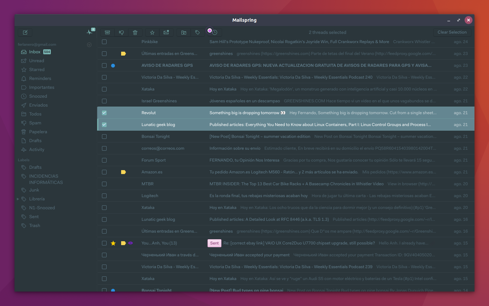

# mailspring-material-adapted
A Material Adapted theme for Mailspring based on [opes](https://github.com/opes/mailspring-material) work. Inspired by [equinusocio's](https://github.com/equinusocio) Material Theme and forked from [jackiehluo's](https://github.com/jackiehluo/n1-material) n1-material.

## Installation
1. Download the [Mailspring](https://getmailspring.com/) email client.
2. Download the [latest release](https://github.com/ferlanero/mailspring-material-adapted) of Material Adapted.
3. On the Mailspring menu, select `Mailspring > Install Theme...`.
4. Find the directory for this plugin to install it. :tada:
